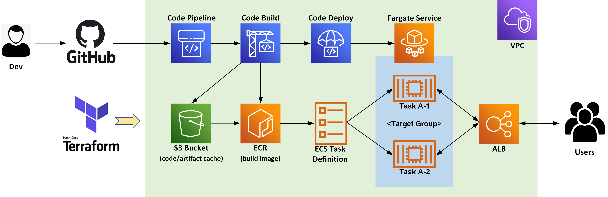

# tf-fargate-codepipeline
A Terrafrom Example that deploys a Cloud Native & Serverless CI/CD envrionment with AWS ECS/Fargate Infrastructure and AWS CodePipeline leveraging GitHub webhook triggers 

---

## References
- [terraform-aws-ecs-fargate](https://github.com/tmknom/terraform-aws-ecs-fargate.git) - Tmknom Terraform Module for creating AWS ECS Fargate resources
- [terraform-aws-ecs-codepipeline](https://github.com/cloudposse/terraform-aws-ecs-codepipeline.git) - CloudPosse Terraform Module for creating AWS CodePipeline on ECS Infrastructure

---
## Guide
- [Refer to my Blog at here](https://route179.dev/2020/06/20/build-a-serverless-ci-cd-pipeline-on-aws-with-fargate-codepipeline-and-terraform/)
